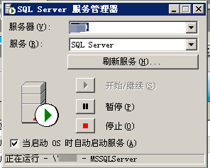

# ERP开源数据结构

#### 介绍
已经停产的某款ERP系统的数据库，已经无人维护了。主要用于生产性企业，包含进销存，物料需求分析，物料清单管理等模块。
之所以开源的原因是这款erp的整体逻辑基本都在数据库里，非常适合新手学习入门构建一个erp系统，并且里面的流程都是经得起考验的。 :smile: 
纯数据库型erp，世面上很少见。
附上服务端，客户端安装包，欢迎学习讨论

如果侵权请通知删除

#### 软件架构
系统要求：windows server2008 最高，
数据库mssql 2000版本，
可以在2000版本安装示范数据库后自行转移到高版本mssql里去。

#### 安装教程

1.  安装mssql2000，再升级到sql2000 sq4，否则不方便远程访问
成功运行的话如下图：

2.  点开安装包里的安装程序，安装服务器端

3.  运行服务器端，右键菜单栏里的图标，启动服务，会提示是否初始化，均点击是即可，等到红点变成绿点就成功了

#### 使用说明

1.  客户端运行在win7以上系统会有卡顿。

2.  加密狗需要的话可以去闲鱼搜索，这个软件自带不完美破解，想完美使用只能加密狗
3.  

本体软件下载：
链接：https://pan.baidu.com/s/10ZnpeQqygedIzn3EdCfGzw?pwd=1bnm 
提取码：1bnm

数据库 mssql2000安装包（安装个人版，也可以网上自己找）：
链接：https://pan.baidu.com/s/1T7vnczd31FZ4_miCXNdquw?pwd=q9it 
提取码：q9it

数据库mssql2000 sp4升级包（也可以网上自己找）：
链接：https://pan.baidu.com/s/1IkjK4ASIGCQ6iYpsNz0fdQ?pwd=xt6g 
提取码：xt6g

安装成功后进入企业管理器查看示范数据库

#### 参与贡献

1.  Fork 本仓库
2.  新建 Feat_xxx 分支
3.  提交代码
4.  新建 Pull Request
5.  有问题可以联系2897994820@qq.com,
6.  编写有关本erp的逻辑脚本。

#### 特技

1.  使用 Readme\_XXX.md 来支持不同的语言，例如 Readme\_en.md, Readme\_zh.md
2.  Gitee 官方博客 [blog.gitee.com](https://blog.gitee.com)
3.  你可以 [https://gitee.com/explore](https://gitee.com/explore) 这个地址来了解 Gitee 上的优秀开源项目
4.  [GVP](https://gitee.com/gvp) 全称是 Gitee 最有价值开源项目，是综合评定出的优秀开源项目
5.  Gitee 官方提供的使用手册 [https://gitee.com/help](https://gitee.com/help)
6.  Gitee 封面人物是一档用来展示 Gitee 会员风采的栏目 [https://gitee.com/gitee-stars/](https://gitee.com/gitee-stars/)
